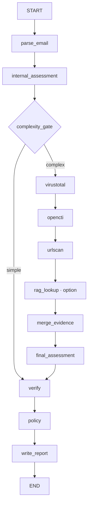

# 1. Architecture du POC

Version de conception : 1.1 — 18/09/2026. Ce dossier spécifie le logiciel à construire ; aucun composant applicatif n'est implémenté et aucune gate n'est déclarée PASS ici.

**Décision runtime contraignante du 19/09/2026 :** le POC courant utilise l'API OpenAI-compatible AkashML (`https://api.akashml.com/v1/chat/completions`). `Qwen/Qwen3.8-27B` est le modèle des runs POC officiels ; `openai/gpt-oss-20b` est réservé aux tests techniques bon marché et ses sorties ne sont jamais des mesures POC. La précédente exécution G2 Genspark + `claude-haiku-4-5` reste un fait historique, pas une preuve runtime courante. Orange LiteLLM reste la cible de démonstration future via les mêmes variables génériques `LITELLM_*`.

**Architecture retenue : un processus Python, un StateGraph séquentiel, deux appels LLM au maximum en fonctionnement nominal et des fichiers locaux.** Chroma n'apparaît qu'en G7-A. La baseline G6 utilise le texte, les métadonnées MIME et les enrichissements réels. Aucune base métier, aucun serveur local, aucun second agent d'analyse.

**Correction utilisateur intégrée : aucune réponse LLM, VT, OpenCTI ou urlscan simulée.** Les fixtures sont des emails d'entrée contrôlés ; leurs analyses officielles passent par le vrai runtime configuré. Les adaptateurs interrogent les vrais services. Sans réponse exploitable, ils retournent un statut explicite. Une réponse archivée est admissible pour la régression uniquement si elle provient d'un appel réel, avec date, empreinte et paramètres conservés. Elle ne devient jamais une nouvelle observation live.

Hypothèse mesurée : l'enrichissement améliore-t-il le triage et les décisions sur les cas difficiles, à un coût et un temps compatibles avec un POC SOC ? La comparaison internal/final ne permet pas, à elle seule, de distinguer les outils de l'effet d'un second appel avec davantage de raisonnement : une expérience de contrôle est prévue sur gold_dev.

## 1.1 Décisions qui corrigent des ambiguïtés du cadrage

| Point | Décision exécutable |
|---|---|
| VirusTotal | Adaptateur GET conservé, SHA-256 des pièces prioritaire puis URL/domain/IP déjà prévus. Si la clé et les droits permettent les appels, utiliser VT réellement. Sinon `unavailable` avec cause, puis OpenCTI → urlscan → FINAL. Aucun upload ni exécution de pièce. Une indisponibilité VT n'empêche ni la construction ni G4/G5/G6 ; la couverture nominale non validée reste explicite. |
| Capacités runtime | Vérifier empiriquement chaque couple fournisseur/modèle. La migration AkashML a observé les deux IDs exacts dans `/v1/models`, les sorties structurées et le raisonnement déclarés, puis l'acceptation réelle de medium/xhigh sur Qwen3.8. Un HTTP 200 ne prouve pas à lui seul une distinction sémantique des efforts. |
| Modèles et rôles | `openai/gpt-oss-20b` : tests techniques uniquement. `Qwen/Qwen3.8-27B` : INTERNAL/FINAL et mesures officielles. Qwen3.6 et Haiku ne sont pas des chemins runtime autorisés. |
| Configuration portable | URL complète courante `LITELLM_CHAT_URL=https://api.akashml.com/v1/chat/completions`. L'application n'ajoute aucun chemin. Une future URL Orange, sa clé et son modèle remplacent uniquement les variables `LITELLM_*` ; aucun fallback fournisseur/modèle silencieux. |
| Chroma et « pas de base de données » | Pas de base pour le corpus ou les rapports. Chroma est l'unique exception, embarquée et facultative, réservée aux cas RAG. |
| Embeddings | Petit modèle local dédié via la fonction ONNX par défaut de Chroma, `all-MiniLM-L6-v2`, modèle et empreinte gelés en G7-A. Ne pas demander à Luna de produire des vecteurs textuels. Mesurer la pertinence sur FR/EN ; ne pas présumer qu'un embedding anglais suffira. |
| Démo OpenCTI | Démo publique confirmée, réinitialisée chaque nuit. Régénération exacte du token toutes les 24 h et feeds effectivement présents non établis ici. Tester les droits et le schéma réels ; traiter 401/403 comme indisponibilité. |
| Enrichissements indisponibles | Un service ne bloque pas l'analyse d'un email. G4 conserve les preuves nominales réelles OpenCTI/urlscan ; pour VT, le traitement vérifié de `unavailable` suffit à poursuivre, sans prétendre avoir validé sa réponse nominale. Causes et couverture figurent dans les résultats et limites. |
| Probabilités | Scores déclarés par le modèle, non calibration statistique démontrée. Le code calcule verdict et confiance à partir du vecteur. |
| `gold_test` et G7 | G6 mesure la baseline sur dev et fige le test. G7 se règle uniquement sur dev. Le test final s'exécute après gel de toutes les variantes. Si le test a déjà été consulté pour décider, un nouveau holdout est nécessaire. |
| Isolation du test et full access | Un AGENTS.md ne protège pas des fichiers accessibles en full access. Le holdout et ses labels restent hors de la machine/espace monté des agents de build jusqu'au gel du code. |

Sources : [restrictions VT](https://docs.virustotal.com/reference/public-vs-premium-api), [Luna](https://developers.openai.com/api/docs/models/gpt-5.6-luna), [OpenCTI](https://github.com/OpenCTI-Platform/opencti), [Chroma embeddings](https://docs.trychroma.com/docs/embeddings/embedding-functions). Sources consultées le 17/09/2026 ; les conditions du compte Orange ne sont pas vérifiées par ces pages publiques.

## 1.2 StateGraph complet

Un seul appel `add_conditional_edges`, sur `complexity_gate`, avec le mapping `simple: verify`, `complex: virustotal`. Tous les autres liens sont des `add_edge`. Aucun cycle, aucun fan-out, aucun sous-graphe. Les erreurs récupérables produisent des données d'état ; elles n'ajoutent pas d'edges. `rag_lookup` est un no-op documenté avant G7-A ou quand désactivé.

Compilation avec `InMemorySaver`, importé depuis `langgraph.checkpoint.memory`, et `configurable.thread_id = run_id`. Le saver est créé par email puis libéré, pour ne pas retenir tout le corpus en RAM. Aucun client, secret ou contenu binaire volumineux dans l'état checkpointé. Un arrêt du processus perd les checkpoints : aucune promesse de reprise durable. [Documentation LangGraph](https://docs.langchain.com/oss/python/langgraph/persistence).

`build_graph(services: Services) -> CompiledStateGraph` reçoit les clients par injection explicite ; `Services` est un simple conteneur Python hors de l'état, pas un framework de plugins. `run_email(path: Path, settings: Settings) -> TriageReport` crée l'état et exécute le graphe. Le batch appelle cette fonction séquentiellement.

## 1.3 Nœuds : responsabilités et contrats

| Nœud | Entrées lues | Champs écrits | Comportement et dépendances |
|---|---|---|---|
| `parse_email` | input_path, run_id, profil de source | parsed, evidence, observable_registry, visual_evidence, errors, parse_ms | `.eml` en bytes ; `mail-parser` pour l'extraction, stdlib pour le parcours MIME et les octets décodés ; BeautifulSoup pour les liens. Aucun réseau. Erreur de lecture/parsing : parsed=null, erreur explicite. |
| `internal_assessment` | parsed, preuves INTERNE, visuels autorisés | internal, internal_call, errors, internal_llm_ms | Appel Qwen3.8 medium, schema strict, aucun outil exposé. Si parsed=null, ne pas appeler. Au plus une nouvelle tentative bornée si sortie invalide/erreur transitoire ; conserver le premier résultat invalide pour mesure. |
| `complexity_gate` | parsed, internal, paramètres du gate | gate, final_candidate sur chemin simple | Applique exactement R1–R3. Sur simple, copie profonde du résultat interne ; aucune réévaluation. |
| `virustotal` | plan d'observables dérivé des seules données internes | enrichment.virustotal, vt_ms | GET lookup uniquement ; SHA-256 puis URL/domain/IP selon ordre défini. Une indisponibilité est une sortie valide. |
| `opencti` | même inventaire interne borné | enrichment.opencti, opencti_ms | Requêtes GraphQL de lecture via pycti. Recherche puis comparaison exacte locale ; ne jamais assimiler le premier résultat à un exact match. |
| `urlscan` | URLs internes sélectionnées | enrichment.urlscan, urlscan_ms | Une URL au maximum ; filtre de sortie avant soumission, private pour emails réels. Poll borné ; téléchargement DOM/screenshot uniquement depuis urlscan. |
| `rag_lookup` | représentation sémantique, exclusions du cas/campagne | enrichment.rag, rag_ms | G7 seulement. Trois voisins au maximum parmi les cas validés. Pas de nouveaux IOC courants issus d'un voisin. |
| `merge_evidence` | preuves internes et résultats normalisés | evidence, observable_registry, visual_evidence, merge_ms | Union par identifiant, collisions refusées ; observables dérivés des outils ajoutés avec leur vraie provenance. Ordre stable. Aucun appel LLM. |
| `final_assessment` | parsed, internal, evidence, contexte RAG, images autorisées | final_candidate, final_call, final_source, final_llm_ms | Appel Qwen3.8 xhigh. Même si les outils n'apportent rien, le second appel reste identifié comme tel. Si échec, reprend internal s'il existe et ajoute un avertissement bloquant AUTO. |
| `verify` | candidate, inventaire/provenances, statuts, internal | verification, accepted_observables, final_validated, verify_ms | Checks déterministes décrits en §5. Ne reformule pas une réponse incorrecte pour la rendre vraie. Retire du rapport accepté les propositions invalides ; conserve les violations à part. |
| `policy` | scores validés, drapeaux, vérifications | action, policy_reasons, policy_ms | Priorités fixes ; recommandation seulement. Ne déplace, supprime ou délivre aucun email. |
| `write_report` | état validé | report_path, report_ms | JSON validé + résumé texte déterministe, écriture atomique. Si disque indisponible : erreur explicite/exit non nul ; ne pas annoncer un rapport sauvegardé. |

Tous les nœuds `node(state: EmailTriageState) -> dict[str, object]` retournent un patch. Les objets Pydantic sont sérialisés en types JSON pour les checkpoints. Le graphe séquentiel utilise un remplacement explicite, sans reducer append implicite susceptible de dupliquer les preuves.

## 1.4 Appel LLM et reproductibilité

Transport minimal vers une API OpenAI-compatible : POST à l'URL complète configurée, `Authorization: Bearer <secret>` ajouté uniquement par le client. Payload officiel : modèle exact `Qwen/Qwen3.8-27B`, messages system/user, `reasoning_effort`, `max_completion_tokens`, `response_format={type:json_schema,json_schema:{name:assessment_v1,strict:true,schema:…}}`. Aucun `tools`, aucun navigateur, aucun accès shell. Ne pas envoyer les anciens paramètres `top_k`/`repetition_penalty`, ni temperature/top_p sans compatibilité démontrée. Le schema d'Assessment est identique pour internal/final ; le contexte disponible diffère. La clé Bearer est opaque : aucun préfixe `sk-*` n'est requis et un `akml-*` n'est jamais transformé.

Les sorties structurées assurent la forme, pas la vérité. Contrôler aussi refus, finish_reason, contenu tronqué, nombres non finis, référence inconnue, sommes des probabilités. La variante exacte du JSON Schema supportée est validée au smoke, sans repli silencieux vers du JSON libre. [Structured outputs](https://developers.openai.com/api/docs/guides/structured-outputs).

Valeurs initiales de budget, ajustables seulement sur dev : 8 192 output tokens internal, 16 384 final, 60 s pour toute la phase internal, 90 s pour toute la phase final, au plus 2 tentatives par phase incluses dans cette durée. Deadline email 240 s ; chaque timeout est borné par le temps restant. Un dépassement retourne REVIEW, jamais `legitime` par défaut. Les coûts des retries sont comptés ; si un timeout a une facturation inconnue, coût=null/partiel, pas zéro.

Les paramètres, empreintes des prompts/configs/schemas, version Python, lock des dépendances, modèle renvoyé, usage et timestamps sont enregistrés. Chaque tentative INTERNAL et FINAL calcule l'audit d'entrée défini en docs/contracts.md §2.6.1 ; il vérifie le câblage et, pour FINAL, la composition expérimentale B/C, pas la justesse du verdict. Le payload exact peut être archivé pour les fixtures uniquement ; pour `public_corpus` et `private_authorized`, il n'est jamais persisté et seuls hashes/compteurs/digests d'audit sont conservés. Aucun seed/temperature ne garantit un LLM identique à chaque appel. « Reproductible » signifie protocole et entrées identifiables ; le recalcul des métriques à partir des réponses archivées est exact, un nouveau run live peut varier.

## 1.5 Parsing et limites

Maximum 25 MiB par `.eml`, 200 parties MIME, profondeur MIME 20, 20 pièces jointes, 20 MiB décodés par pièce, 40 MiB décodés cumulés. Toute limite atteinte figure dans `content_limits` et interdit AUTO. Pas de décompression d'archives, pas d'exécution, pas de macro/PDF renderer, pas de fetch d'image distante, pas de résolution des liens par le parser. Pièces jointes : métadonnées et SHA-256/SHA-1/MD5 seulement. Les images seront décodées comme images inertes, de manière bornée, uniquement en G7-B.

Préserver les en-têtes dans leur ordre, y compris répétitions et défauts. Ne pas remplacer silencieusement From par Return-Path. `Authentication-Results` est un texte reçu : il peut être forgé. Sans provenance de collecte digne de confiance et authserv-id configuré, marquer `reported_unverified`. DKIM-Signature présent ne signifie pas signature vérifiée. SPF/DKIM/DMARC PASS ne prouvent jamais l'intention bénigne.

Préserver text/plain et HTML originaux ; fournir au modèle texte décodé et représentation HTML bornée. Extraire les href, URL visibles, action de formulaire et ressources distantes comme rôles distincts. Conserver href et display séparément. Le mismatch compare uniquement des hôtes explicitement visibles, pas un texte « cliquer ici ». Ne pas considérer deux hôtes différents comme preuve de phishing. Déduire les domaines d'URLs avec `urllib.parse` et IDNA, sans inventer de destinations. Aucune bibliothèque nécessitant un téléchargement live de Public Suffix List.

Normalisation de comparaison : scheme/hostname en minuscules, hostname IDNA, port par défaut supprimé ; chemin, query, ordre des paramètres et encodage conservés. Conserver toujours la valeur exacte extraite. Fragments conservés dans l'original ; leur retrait éventuel pour un fournisseur doit être enregistré comme transformation, sans revendiquer un exact match de l'original. URLs relatives non résolues sans base absolue explicite ; `<base>` reste une donnée non fiable. Désobfuscation `hxxp`/`[.]` seulement avec valeur dérivée et lien vers l'original.

Le parser assigne des rôles : sender, return_path, reply_to, recipient, link_target, displayed_brand, shared_host, transport_ip, attachment, campaign_id. Les destinataires restent dans les acteurs de l'email mais sont exclus des IOC et des requêtes externes. Les IP privées/transport non discriminant sont exclues des lookups. Les fichiers exportés utilisent des noms basés sur SHA-256, jamais le filename fourni par l'email.

## 1.6 Adaptateurs réels, données sortantes et quotas

`lookup(query: Observable, context: ToolContext) -> ToolResult`. Le contexte comprend deadline, source_profile et politique de sortie ; il ne va jamais au LLM. Résultats normalisés par prédicats typés, pas de JSON fournisseur géant.

Statuts : `ok`, `not_found`, `unavailable`, `skipped`. `ok` ne signifie pas bénin. `not_found` est un succès technique sans correspondance. `unavailable` porte une cause (`not_configured`, `access_not_authorized`, `timeout`, `rate_limited`, `auth_error`, `api_error`, `malformed_response`, `deadline`). `skipped` porte `disabled`, `not_applicable`, `privacy_policy` ou `budget`. Les listes de résultats contiennent aussi les omissions pertinentes, pour exposer la couverture réelle.

Plan déterministe : jusqu'à 4 cibles par fournisseur de lookup ; priorité SHA-256 d'attachement, URL href/form à mismatch, autres href/texte dans l'ordre MIME, puis domaine exact expéditeur/reply-to et IP publique discriminante. Pas trois lookups pour SHA-256/SHA-1/MD5 d'un même fichier. Pas de recherche de phrases, pas de WHOIS, pas de pivot itératif, pas d'enrichissement récursif des ressources découvertes par urlscan.

**Sorties vers tiers :** envoyer une URL en private divulgue encore sa valeur au fournisseur et provoque une visite pouvant déclencher un tracking. Refuser URL avec userinfo, jeton évident/password/reset/unsubscribe/action à effet, identifiant personnel détecté, host interne, IP non globale, `.test`/`.invalid`/localhost ou schéma autre que HTTP(S). Une politique client configurée doit autoriser les tiers concernés et les URLs exactes ; la détection automatique ne garantit pas l'absence de secret. À défaut, aucun envoi d'URL réelle. Ne pas « anonymiser » une URL puis traiter le résultat comme sa destination exacte. Les domaines publics approuvés et hashes suivent leur propre autorisation de partage. Démo OpenCTI = tiers externe, même en lecture seule.

VT non configuré, indisponible, limité, refusé ou non autorisé : `unavailable` et cause obligatoire (`not_configured`, `timeout`, `rate_limited`, `auth_error`, `access_not_authorized`, `api_error`, etc.). Zéro requête si clé/droits absents ; aucune preuve positive inventée. Continuer les nœuds suivants, même sans aucune capture nominale VT.

VT : vt-py, seuls GET `/files/{hash}`, `/urls/{vt.url_id(url)}`, `/domains/{domain}`, `/ip_addresses/{ip}`. Aucun POST, upload, analyse à la demande, téléchargement d'échantillon ou recherche premium. Valeurs absentes=null. Ne pas supposer chaque champ accessible avec chaque licence. Conserver dénominateur réel des catégories d'analyse ; pas de `12/90` construit à partir d'un mauvais total. Limiteur local conservateur 4 requêtes/60 s et 500/jour UTC pour le profil public ; réviser selon l'accès autorisé réel. Pas d'attente sur un 429 : `unavailable`, puis suite. Un petit JSON de quotas et les headers du service évitent les redémarrages qui oublient le budget ; ne garantissent pas le suivi d'autres utilisateurs de la même clé. Temps total de la phase ≤20 s. Les collectes de benchmark peuvent être espacées explicitement hors analyse ; temps d'attente rapporté séparément.

OpenCTI : pycti aligné avec la version observée, `stix_cyber_observable.list(search=value, first=10, getAll=False)` si cette signature est validée. Projection limitée. Comparer `observable_value`/hashes et type ; résultats non exacts signalés et non utilisés comme corroboration exacte. `list(search=…)` n'est pas une preuve de malveillance. Pas de mutations GraphQL ni création d'observable. Score, labels, dates et références sont des assertions de la source ; leur absence ne permet aucune conclusion. Budget ≤20 s. La forme des filtres dépend du schéma serveur, figé après lecture réelle. [API OpenCTI](https://docs.opencti.io/latest/reference/api/).

urlscan : une soumission au plus par email complexe éligible. `visibility=private` obligatoire pour toute source réelle ; `unlisted` seulement pour fixture non sensible si expressément configuré. Jamais fallback public/unlisted sur quota private épuisé. Le site affiche actuellement 50 private/jour ; quota effectif lu pour le compte. [Tarifs urlscan](https://urlscan.io/pricing/).

Après POST accepté : valider UUID et visibilité, conserver immédiatement le scan_id ; attendre 10 s, puis poll toutes les 5 s, budget total 45 s. 404 avant résultat=pending, pas `not_found`; 410=supprimé, 429=indisponible. Pas de nouvelle soumission automatique après timeout ambigu du POST (risque de double visite/quota). Après succès, récupérer le DOM en texte inerte et le screenshot si G7-B actif ; un 404 de screenshot ne supprime pas le résultat JSON. Construire les URLs de récupération à partir de l'origin urlscan configurée et du UUID validé, sans suivre une URL arbitraire dans la réponse. Redirections HTTP de l'API autorisées seulement au sein de l'origin approuvée, jamais avec clé vers un autre hôte. [API urlscan](https://urlscan.io/docs/api/).

Extraire les navigations du document principal, pas toutes les requêtes réseau comme une redirect chain. Si le résultat n'expose pas une chaîne démontrable, chaîne partielle/inconnue ; ne pas inventer les étapes. `page.url` = observation de cette exécution, pas garantie d'état historique. DOM : champs de formulaires, titres, extraits bornés. Screenshot analysé par Luna reste une interprétation visuelle ; `verdicts` fournisseur est nommé comme tel. [Résultat urlscan](https://urlscan.io/docs/result/).

## 1.7 Structure minimale du repo à implémenter

Conserver le layout demandé `src/` comme package importable, déclaré explicitement dans setuptools. Ajouter seulement `src/config.py` (configuration), `src/reporting.py` (résumé/écriture), `src/metrics.py` (calculs), `schemas/` (contrats), `docs/contracts.md`, `docs/gates.md`, `docs/fixtures.md`, `docs/tickets/`, `scripts/check_gate.py`, `scripts/smoke.py`, `scripts/validate_reports.py`, `scripts/manage_rag.py` en G7-A. Tests séparés par sujet, sans serveur de tests factice. `requirements.lock` est généré et testé en G0, mis à jour dans le ticket qui ajoute une dépendance. `corpus/`, `runs/`, les pièces et les réponses fournisseurs sont gitignored ; aucun email client dans Git.

Persistences : `runs/<run_id>/report.json`, `summary.txt`, `events.jsonl`, `responses/` (réponses live et provenance, données restreintes), `artifacts/` (images autorisées) ; `runs/batches/<batch_id>/results.jsonl`, `metrics.json`, `confusion_matrix.csv`, `run_manifest.json`. Cache de lookup facultatif en fichiers, désactivé pour mesures de latence live. Aucun cache d'échec, pas de rescan automatique. Le cache doit afficher sa date/source ; il ne devient pas une observation actuelle.

Package Python 3.11 recommandé ; Windows PowerShell ou Linux. Dépendances baseline : langgraph>=1.0.10,<2 ; langgraph-checkpoint>=4.1.1,<5 ; pydantic>=2,<3 ; pydantic-settings>=2,<3 ; httpx, mail-parser, beautifulsoup4, vt-py, pycti, PyYAML ; pytest en dev. pyarrow et scikit-learn seulement en G6. chromadb seulement G7-A ; Pillow et zxing-cpp seulement G7-B. Résoudre et pinner les versions réellement compatibles, sans inventer de lock dans le plan. Aucun téléchargement de modèles à l'analyse.

Environnement : `.env.example` sans valeurs secrètes ; Settings utilise SecretStr, extra=forbid pour les YAML, configuration validée au démarrage. `MODEL_SUPPORTS_VISION=false`, `RAG_ENABLED=false`, `QR_DECODE_ENABLED=false`, `LIVE_INTEGRATION=0`, `VT_ACCESS_AUTHORIZED=false` par défaut. Les flags activent des composants validés, jamais un contournement des gates.

Les logs ordinaires contiennent IDs, statuts, durées et nombres, pas bodies, URLs à jetons, en-têtes HTTP ni clés. Les réponses brutes gardées pour audit sont séparées et ne sont pas jointes aux prompts de coding. Autoriser uniquement le proxy et les adaptateurs réseau du runtime ; full access Codex concerne la construction, pas les droits confiés au modèle d'analyse.

## 1.8 État d'implémentation (TICKET-11, 19/09/2026)

Le paragraphe §1.2 est implémenté tel quel par `src/graph.py` :

- `build_graph(services) -> CompiledStateGraph` compile exactement les douze nœuds de §1.3 et les liens de §1.2. Un seul `add_conditional_edges` existe, sur `complexity_gate`, avec le mapping figé `simple: verify` / `complex: virustotal` ; tous les autres liens sont des `add_edge`. Aucun cycle, fan-out ou sous-graphe.
- Un `InMemorySaver` neuf est créé par graphe compilé ; `run_email` compile un graphe par email avec `configurable.thread_id = run_id`. Le saver est libéré avec le graphe local : aucun registre de module ne le retient et les checkpoints d'un run ne survivent pas au processus (aucune reprise durable promise).
- Aucun client, secret, deadline ou bytes MIME n'entre dans l'état checkpointé. Les erreurs récupérables (parsing, LLM, indisponibilité fournisseur, refus de merge) deviennent des données d'état typées et n'ajoutent aucun edge ; une écriture de rapport refusée lève immédiatement.
- `Services` est le conteneur par run hors état : Settings, configs YAML validées, adaptateurs réels VT/OpenCTI/urlscan, `egress`, `run_dir`/`capture_dir`, horloge monotone + deadline email, et deux clients phase-bound (`luna` INTERNAL, `luna_final` FINAL) car `LunaClient` appartient à une phase unique. Aucun client n'est reconstruit par un nœud.
- Sans `LITELLM_API_KEY`, les nœuds INTERNAL/FINAL refusent la phase sans émettre de requête (erreur explicite) : rien n'est simulé.
- `rag_lookup` est un no-op documenté avant G7-A (aucun contexte inventé) ; un adaptateur RAG injecté est refusé par une erreur typée au lieu d'être ignoré silencieusement.
- Plans d'observables déterministes bornés (≤ `max_targets` VT/OpenCTI, ≤ `max_urls` urlscan) : SHA-256 de pièce, URLs href/visible/form/QR avec mismatch d'abord puis ordre MIME, domaines expéditeur/reply-to, IP publiques ; les ressources distantes décoratives ne sont jamais envoyées et les destinataires jamais des cibles.
- `run_email(path, settings, source_profile=...)` crée l'état, exécute le graphe et ne retourne le rapport qu'une fois `report.json` réellement écrit et relu depuis le disque.
- Persistance par run : `RUNS_DIR/<run_id>/report.json`, `summary.txt`, `events.jsonl` (une ligne par nœud, ordre figé), `responses/`. Écriture atomique (fichier temporaire + `os.replace`), refus explicite d'écraser un artefact existant. Le résumé français ≤ 100 mots est rendu par templates déterministes (aucun troisième appel Luna), échappé et défangé ; les valeurs exactes restent dans le JSON restreint.
- Batch (`run_batch.py`) séquentiel, entrées triées par chemin : `results.jsonl` (une ligne par entrée, ligne d'erreur explicite en cas d'échec), `metrics.json`, `run_manifest.json`, rapports sous `reports/<run_id>/`. Un email défaillant n'arrête pas le batch ; l'exit est non nul si au moins une entrée n'a pas produit de rapport.
- `total_ms` est mesuré de l'entrée du run à la projection du rapport (immédiatement avant l'écriture atomique), jamais obtenu en additionnant des arrondis ; `report_ms` mesure la construction du rapport.
